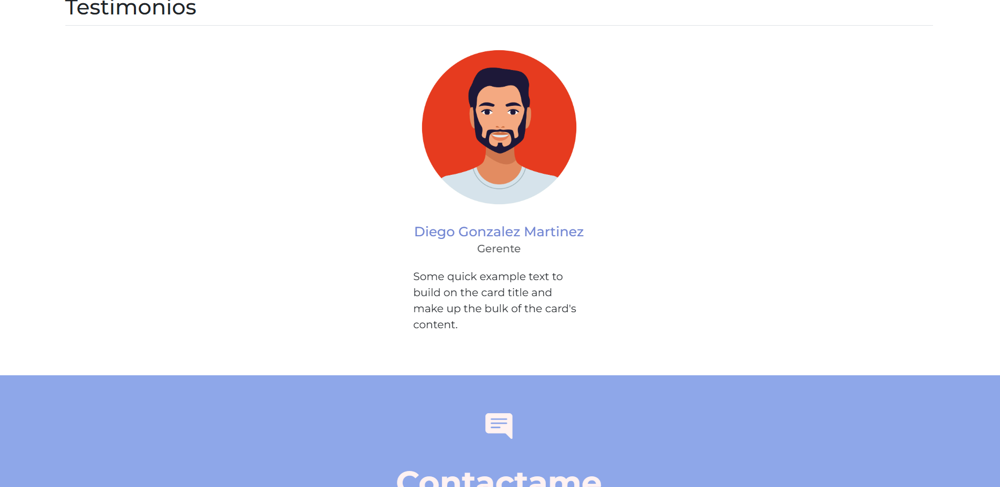

## Portafolio de Proyectos

¡Hola! Soy ***Lilia Yasmin Pérez Velázquez***, **estudié la carrera de Ingeniería en Comunicaciones y Electrónica**. Aquí encontrarás información sobre mí.

______
### El proyecto cuenta con las siguientes secciones:

- 💪 Habilidades
- 📋 Proyectos
- 🙎‍♂️ Testimonios
- 📫 Contacto

### Creado con:

- HTML
- CSS
- JavaScript

### Vista Previa

### *Espero pronto saber de ti*
*Correo:*  
[yas21092000@gmail.com](mailto:yas21092000@gmail.com)

________

### Creado en el Bootcamp de TecnolochicasPro 💜  
[Tecnolochicas](https://tecnolochicas.mx/)
